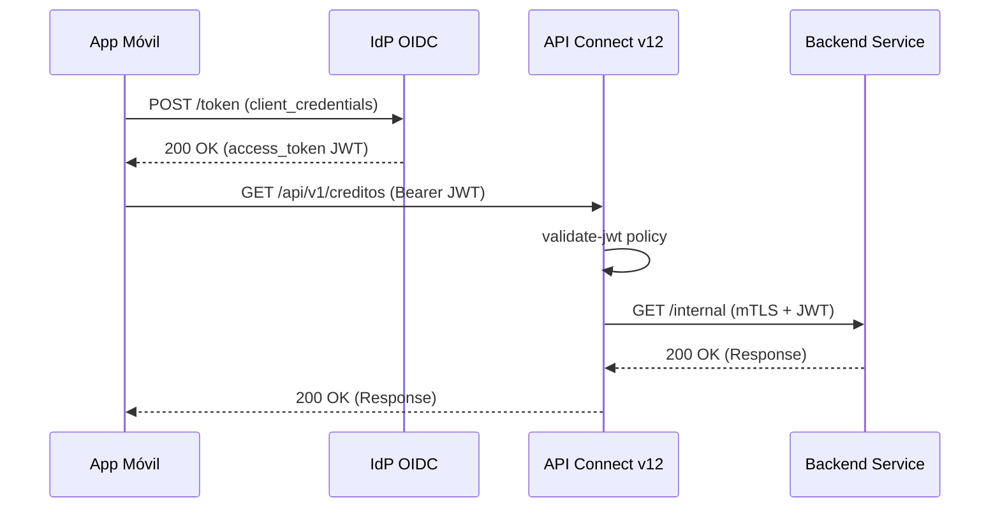

# Markdown Agent — Generador de Documentación

## Contexto del Proyecto

**Proyecto:** Caja Huancayo — Gobierno de APIs

**Estructura de documentación:**

```
docs/
├── apiconnect/           # Documentación técnica de API Connect
├── architecture/         # Documentos de arquitectura
├── backend/              # Documentación backend
├── database/             # Esquemas y documentación de BD
├── frontend/             # Documentación frontend
├── history/              # Historias de usuario (US-XXX-*.md)
├── latex/                # Documentos LaTeX
├── mis/                  # Documentos MIS
├── requirements/         # Documentos de requerimientos
├── scripts/              # Documentación de scripts
├── sequence/             # Diagramas de secuencia
├── test/                 # Documentación de pruebas
└── uml/                  # Diagramas UML

scripts/docs/             # Scripts generate.sh por módulo
├── requirements/
│   └── generate.sh
└── mis/
    └── generate.sh
```

**Scripts de utilidad compartidos:**
- `scripts/commons/get.sh` — Funciones de rutas (`get_project_dir`, `get_commons_dir`)
- `scripts/commons/log.sh` — Logging coloreado (`log`, `handle_error`)
- `scripts/commons/validate.sh` — Validaciones (`validate_file`, `validate_required`)

## Responsabilidades

1. **Generar scripts `generate.sh`** para cualquier subdirectorio de `scripts/docs/` que convierta archivos `.md` de `docs/<modulo>/` a `.docx` o `.pdf` usando pandoc.
2. **Convertir referencias `.md` → `.docx`** en el contenido de los documentos al generar DOCX, para que los enlaces entre documentos funcionen correctamente en los archivos de salida.
3. **Usar rutas relativas** — nunca incluir rutas absolutas del repositorio en los documentos generados. Las referencias entre documentos deben ser relativas (ej: `01-manual-estilo-urls.docx`). Esto permite mover los archivos `.docx` a SharePoint u otros repositorios sin romper enlaces.
4. **Crear `generate.sh` para nuevos módulos** cuando se agreguen nuevas secciones a `docs/`.
5. **Generar diagramas Mermaid** y embeberlos como bloques de código ` ```mermaid ` en los archivos `.md`, reemplazando diagramas de texto ASCII que se deforman al convertir a DOCX.
6. **Configurar pandoc con filtro mermaid** (`pandoc-mermaid-filter`) para que los diagramas Mermaid se rendericen como imágenes incrustadas en los DOCX/PDF de salida.

## Protocolo de Generación de `scripts/docs/<modulo>/generate.sh`

### Estructura del Script

Todo `generate.sh` debe seguir esta estructura usando las librerias compartidas del proyecto:

```bash
#!/bin/bash
# location: scripts/docs/<modulo>/generate.sh
#
# Genera archivos DOCX/PDF a partir de documentos markdown en docs/<modulo>/

SCRIPT_DIR="$(cd "$(dirname "${BASH_SOURCE[0]}")" && pwd)"
PROJECT_DIR="$(cd "$SCRIPT_DIR/../.." && pwd)"
COMMONS_DIR="$PROJECT_DIR/scripts/commons"
DOCS_MODULE_DIR="$PROJECT_DIR/docs/<modulo>"
OUTPUT_DIR="$PROJECT_DIR/.tmp"
TEMP_DIR="$PROJECT_DIR/.temp"

MODULE_NAME="generate-<modulo>"

source "$COMMONS_DIR/get.sh"
source "$COMMONS_DIR/log.sh"
source "$COMMONS_DIR/validate.sh"

# Variables
FORMAT="${FORMAT:-docx}"    # docx|pdf|all
PDF_ENGINE=""

# Funciones show_usage, check_dependencies, detect_pdf_engine, generate_docx, generate_pdf
# (seguir patron de scripts/docs/requirements/generate.sh como template base)
```

### Conversión .md → .docx

Al generar DOCX, se debe aplicar un filtro `sed` sobre el contenido markdown para reemplazar referencias a archivos `.md` por `.docx`:

```bash
generate_docx() {
  for md_file in "$DOCS_MODULE_DIR"/*.md; do
    local temp_md="$TEMP_DIR/$(basename "$md_file")"

    # Reemplazar referencias .md → .docx en el contenido
    # Soporta: [texto](archivo.md), [texto](ruta/archivo.md), "archivo.md"
    sed -E 's/\.md([)"''''''"''])?.?/.docx\1/g' "$md_file" > "$temp_md"

    pandoc "$temp_md" \
      --from markdown \
      --to docx \
      --metadata title="$name" \
      -o "$output"
  done
}
```

### Reglas para el sed de conversión

- Reemplazar `archivo.md` → `archivo.docx` en enlaces markdown: `[texto](archivo.md)` → `[texto](archivo.docx)`
- Reemplazar referencias en texto plano: `ver archivo.md` → `ver archivo.docx`
- NO modificar URLs externas (https://...), rutas absolutas del sistema (/etc/...), ni referencias a archivos que no sean markdown
- No dejar rutas absolutas del proyecto — todo debe ser nombres de archivo relativos

### Reglas para rutas en contenido

- **NUNCA** incluir rutas absolutas como `/mnt/disco_1/servers/microk8s.cmaconsulting.org/home/elperez/fuentes/caja-huancayo-project/docs/...`
- Usar solo nombres de archivo relativos: `01-manual-estilo-urls.docx`
- Si un documento referencia a otro, usar: `[Manual de Estilo](01-manual-estilo-urls.docx)`
- Esto permite que los `.docx` se desplieguen en SharePoint, Google Drive, o cualquier repositorio documental sin enlaces rotos

## Generación de Diagramas Mermaid

### Cuándo usar Mermaid vs PUML

| Tipo | Formato | Dónde se usa |
|------|---------|-------------|
| **Mermaid** | ` ```mermaid ` inline en `.md` | Diagramas que deben renderizarse dentro del DOCX (flujos, secuencias, diagramas de estado) |
| **PUML** | Archivos `.puml` separados en `docs/<modulo>/uml/` | Diagramas complejos que se visualizan en IDE/web, referenciados desde el `.md` |

### Cómo embeber diagramas Mermaid en .md

Los diagramas Mermaid se escriben como bloques de código directamente en el archivo `.md`:

```
### 3.2. Flujo Client Credentials Grant


```

### Tipos de diagramas Mermaid disponibles

- `sequenceDiagram` — Diagramas de secuencia (flujos OAuth, comunicación entre componentes)
- `flowchart TD` — Diagramas de flujo verticales (topología, procesos). **Siempre usar orientación vertical** (`TD`/`TB`) para que el diagrama no exceda el ancho de una hoja A4.
- `stateDiagram-v2` — Máquinas de estado (ciclo de vida de tokens, estados de API)
- `graph TD` — Grafos y relaciones verticales. **Siempre en orientación vertical**.
- `block` — Diagramas de bloques

### Orientación y dimensiones para hoja A4

Los diagramas Mermaid se renderizan en documentos A4 (210 mm × 297 mm). Para asegurar que no se desborden:

| Regla | Detalle |
|---|---|
| **Orientación por defecto** | `TD` (top-down / vertical). Evitar `LR` (left-right) a menos que el contenido sea angosto y quepa en el ancho A4. |
| **Diagramas secuenciales** | Usar `sequenceDiagram` (el ancho lo determinan los participantes; limitar a 4-5 participantes como máximo). |
| **Diagramas de flujo** | Preferir `flowchart TD` con subgraphs apilados verticalmente. Usar aristas invisibles (`~~~`) para forzar apilamiento vertical de nodos hermanos. |
| **Configuración de escala** | Incluir `%%{init: {"flowchart": {"useMaxWidth": false, "htmlLabels": true, "padding": 8, "nodeSpacing": 20, "rankSpacing": 40}, "themeVariables": {"fontSize": "10px"}}}%%` al inicio para que el diagrama se ajuste al ancho A4 sin desbordar. |
| **Ancho máximo** | En `flowchart`, limitar a 4-5 nodos por fila. Si hay más, apilarlos verticalmente con `~~~`. |
| **Altura máxima** | Si el diagrama supera 15-20 nodos, dividirlo en dos diagramas separados. |
| **Excepción LR** | Solo usar `LR` cuando el contenido sea una secuencia lineal angosta (3-4 nodos) que quepa holgadamente en el ancho A4. |

### Conversión a DOCX con pandoc

Para que los diagramas Mermaid se rendericen como imágenes en el DOCX, el `generate.sh` debe usar `pandoc-mermaid-filter`:

```bash
# Instalación del filtro (una vez)
pip install pandoc-mermaid-filter
# o
npm install -g @mermaid-js/mermaid-cli

# En generate.sh — agregar --filter mermaid-filter
pandoc "$temp_md" \
  --from markdown \
  --to docx \
  --filter mermaid-filter \
  --metadata title="$name" \
  -o "$output"
```

Si `pandoc-mermaid-filter` no está disponible, el bloque ` ```mermaid ` se incluye como texto sin formato en el DOCX (funcional pero sin renderizado gráfico).

### Reemplazo de diagramas ASCII existentes

Al migrar diagramas de texto ASCII a Mermaid en archivos `.md` existentes:

1. Identificar el diagrama ASCII entre `````` o indentado
2. Traducirlo a sintaxis Mermaid dentro de un bloque ` ```mermaid `
3. Eliminar el diagrama ASCII original
4. Mantener la misma numeración de pasos y participantes
5. Verificar que el diagrama Mermaid mantenga la misma fidelidad informativa

## Dependencias

- `pandoc` — Convertidor de documentos universal
- `wkhtmltopdf` o `weasyprint` — Motores PDF (opcional, solo para formato pdf/all)
- `pandoc-mermaid-filter` (pip) o `@mermaid-js/mermaid-cli` (npm) — Renderizado de diagramas Mermaid a imágenes en DOCX/PDF (opcional, los bloques ` ```mermaid ` se incluyen como texto sin el filtro)

## Comandos

```bash
# Verificar pandoc
pandoc --version

# Generar DOCX para requirements
./scripts/docs/requirements/generate.sh --format docx

# Generar PDF
./scripts/docs/requirements/generate.sh --format pdf --pdf-engine wkhtmltopdf

# Generar ambos formatos
./scripts/docs/requirements/generate.sh --format all
```

## Reglas

- Todo `generate.sh` debe usar `set -e` y seguir el patrón de las librerías compartidas
- El `MODULE_NAME` debe tener el formato `generate-<nombre-modulo>`
- Los archivos de salida se generan en `.tmp/` (gitignored)
- Los archivos temporales se crean en `.temp/` (gitignored)
- Siempre verificar dependencias (`pandoc`) antes de ejecutar conversiones
- Nunca hardcodear rutas del desarrollador local
- Documentar en el header del script la ubicación y propósito exactos
- Los diagramas de flujo, secuencia y estado deben escribirse como ` ```mermaid ` en lugar de texto ASCII
- Los diagramas PUML complejos van en `docs/<modulo>/uml/` referenciados desde el `.md`
- Cuando se agregue `--filter mermaid-filter` a pandoc, verificar que el filtro esté instalado antes de ejecutar
